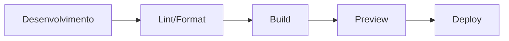

# 🏗️ Arquitetura do Sistema

[](https://adr.github.io/madr/)
[](https://www.w3.org/TR/WCAG21/)
[](https://developers.google.com/web/tools/lighthouse)

> **Architectural Decision Records (ADRs)** - Documentação das decisões arquiteturais que moldaram este sistema web focado em arquitetura contemporânea, performance e acessibilidade.

## 📋 Sobre este Documento

Este arquivo segue o padrão **MADR (Markdown Architectural Decision Records)**, documentando as decisões técnicas significativas tomadas durante o desenvolvimento. Cada decisão inclui contexto, opções consideradas, escolha final e consequências.

## 🚨 REGRA OBRIGATÓRIA PARA LLMs - ATUALIZAÇÃO DE DOCUMENTAÇÃO

**REGRA ABSOLUTA E EXCLUSIVA**

Toda vez que uma LLM realizar **QUALQUER** alteração arquitetural, técnica ou estrutural no código, este documento `ARCHITECTURE.md` deve ser **OBRIGATORIAMENTE** atualizado com novos ADRs (Architectural Decision Records).

### 📋 Quando Criar um Novo ADR:

1. **Mudanças na arquitetura** → Sempre criar ADR documentando decisão
2. **Escolha de novas tecnologias** → ADR obrigatório
3. **Alterações em design patterns** → Documentar decisão
4. **Mudanças em estrutura de arquivos** → ADR para justificativa
5. **Decisões de performance** → ADR detalhado
6. **Modificações em acessibilidade** → ADR completo

### 📝 Formato Obrigatório do ADR:

```markdown
### ADR XXX: Título Descritivo

**Status:** ✅ Accepted | **Data:** YYYY-MM-DD | **Responsável:** LLM/Equipe

#### Contexto

[Descrição do problema/contexto]

#### Opções Consideradas

**Opção 1: [Nome]**

- ✅ Prós...
- ❌ Contras...

#### Decisão

[Escolha final com justificativa]

#### Consequências

- **Positivo**: [Benefícios]
- **Negativo**: [Trade-offs]
- **Mitigação**: [Soluções implementadas]
```

### 🚫 PROIBIDO:

- Fazer mudanças no código sem documentar em ADR
- Modificar arquitetura sem justificativa documentada
- Alterar decisões técnicas sem registro histórico

**VIOLAÇÃO DESTA REGRA COMPROMETE A QUALIDADE E MANUTENIBILIDADE DO PROJETO.**

## 🚨 REGRAS ABSOLUTAS ADICIONAIS - ORGANIZAÇÃO ARQUITETURAL

### 1. 🏗️ EXCELÊNCIA ORGANIZACIONAL - PRIORIDADE MÁXIMA

**TODAS as alterações devem ser guiadas por padrões organizacionais superiores**

#### 📋 Princípios Arquiteturais Obrigatórios:

- **Organização arquitetural**: Código estruturado com clareza arquitetural impecável
- **Padronização arquitetural**: Seguir padrões estabelecidos para organização de arquivos
- **Localização arquitetural**: Arquivos sempre posicionados no local arquiteturalmente ideal
- **Consistência estrutural**: Manter arquitetura lógica e escalável
- **Documentação arquitetural**: Justificar decisões organizacionais em ADRs quando relevante

#### 🚫 VIOLAÇÕES ARQUITETURAIS PROIBIDAS:

- ❌ Arquivos criados em locais arquiteturalmente inadequados
- ❌ Desorganização da estrutura arquitetural existente
- ❌ Violação de padrões organizacionais estabelecidos
- ❌ Manutenção de código com arquitetura deficiente

### 2. 📚 GOVERNANÇA DOCUMENTAL ARQUITETURAL

**PROIBIÇÃO ABSOLUTA de criação de nova documentação arquitetural**

#### 📋 Governança Estrita:

- **Atualização exclusiva**: Trabalhar apenas com documentação arquitetural existente em `docs/`
- **Criação arquitetural vetada**: Nenhuma nova documentação arquitetural pode ser criada
- **Documentos arquiteturais sagrados**: `README.md` (raiz) e `INFO.md` são arquiteturalmente imutáveis
- **Modificações arquiteturais controladas**: Apenas conteúdo dos arquivos arquiteturais existentes

#### 🚫 PROIBIDO ARQUITETURALMENTE:

- ❌ Criar `ARQUITETURA.md`, `DESIGN.md` ou qualquer documentação arquitetural nova
- ❌ Alterar `README.md` na raiz arquitetural do projeto
- ❌ Modificar `INFO.md` arquiteturalmente
- ❌ Estabelecer documentação arquitetural paralela fora de `docs/`

### 3. 🌐 ARQUITETURA HTML DEFINITIVA

**O arquivo `index.html` deve manter sua posição arquitetural na raiz do projeto**

#### 📋 Arquitetura Fixa:

- **Posição arquitetural**: Sempre na raiz (`/index.html`) - arquitetura definitiva
- **Imutabilidade arquitetural**: Posição arquitetural nunca deve ser alterada
- **Consistência arquitetural**: Manter padrão arquitetural de acesso consistente

#### 🚫 PROIBIDO ARQUITETURALMENTE:

- ❌ Mover arquiteturalmente para `src/index.html` ou subdiretórios
- ❌ Criar arquiteturas paralelas do index.html
- ❌ Alterar referências arquiteturais ou caminhos

---

**ESSAS SÃO REGRAS ARQUITETURAIS ABSOLUTAS - VIOLAÇÃO COMPROMETE A INTEGRIDADE ARQUITETURAL DO SISTEMA.**

### 🎯 Propósito dos ADRs

- **Transparência**: Explicar o "porquê" por trás das decisões técnicas
- **Contexto**: Preservar conhecimento para novos desenvolvedores
- **Evolução**: Guiar futuras decisões e refatorações
- **Justificativa**: Demonstrar análise técnica das alternativas

## 🎯 Visão Geral da Arquitetura

Sistema web modular e escalável focado em performance, acessibilidade e manutenibilidade para o site institucional de Rafael Munaro Arquitetura.

### Princípios Fundamentais

1. **Separação de Responsabilidades**
   - HTML: Estrutura semântica e acessível
   - CSS: Apresentação visual e design system
   - JavaScript: Comportamento e interatividade

2. **Modularidade**
   - Componentes independentes e reutilizáveis
   - CSS organizado em módulos temáticos
   - JavaScript com classes ES6+ e imports modulares

3. **Performance-First**
   - Lazy loading de recursos críticos
   - Code splitting preparado para escalabilidade
   - Otimizações de assets e cache strategies
   - Core Web Vitals como prioridade

4. **Acessibilidade (WCAG 2.1 AA)**
   - HTML semântico completo
   - ARIA labels e roles apropriados
   - Navegação por teclado fluida
   - Contraste adequado e foco visível

## 📁 Estrutura de Diretórios

```
site_rafael-munaro-arquitetura/
├── docs/                      # 📚 Documentação
│   ├── README.md             # Visão geral
│   ├── AGENTS.md             # Agentes de IA
│   ├── CHANGELOG.md          # Histórico
│   ├── RULES.md              # Regras
│   └── ARCHITECTURE.md       # Este arquivo
│
├── src/                       # 💻 Código fonte
│   ├── index.html            # HTML antigo
│   ├── index-new.html        # ⭐ Novo design otimizado
│   │
│   ├── assets/               # 🎨 Assets estáticos
│   │   ├── fonts/           # Fontes customizadas
│   │   ├── icons/           # Ícones SVG
│   │   └── images/          # Imagens
│   │
│   ├── js/                   # 📜 JavaScript
│   │   ├── main.js          # Sistema antigo
│   │   ├── new-design.js    # ⭐ Sistema novo
│   │   └── topographic-background.js # ⭐ Animação de fundo
│   │
│   ├── styles/               # 🎨 CSS
│   │   ├── base.css         # ⭐ Design tokens
│   │   ├── new-components.css # ⭐ Componentes
│   │   ├── new-sections.css   # ⭐ Seções
│   │   └── new-responsive.css # ⭐ Responsividade
│   │
│   └── components/           # 🧩 Componentes JS
│       ├── header.js
│       ├── navigation.js
│       └── footer.js
│
├── public/                    # 📦 Build output
├── .editorconfig             # Editor config
├── .eslintrc.js              # ESLint rules
├── .prettierrc               # Prettier config
├── package.json              # Dependências
└── vite.config.js            # Vite config
```

## 📋 Architectural Decision Records (ADRs)

### ADR 001: Escolha da Stack Tecnológica Frontend

**Status:** ✅ Accepted | **Data:** Outubro 2025 | **Responsável:** Equipe de Desenvolvimento

#### Contexto

Precisávamos escolher uma stack tecnológica moderna para desenvolvimento web focada em performance, DX (Developer Experience) e acessibilidade, considerando o público-alvo de arquitetura contemporânea.

#### Opções Consideradas

**Opção 1: React + Next.js**

- ✅ SSR/SSG para SEO
- ✅ Componentes reutilizáveis
- ✅ Ecossistema maduro
- ❌ Bundle size maior
- ❌ Curva de aprendizado
- ❌ Overkill para site institucional simples

**Opção 2: Vue.js + Nuxt**

- ✅ DX excepcional
- ✅ Curva de aprendizado suave
- ✅ Performance boa
- ❌ Menor adoção no Brasil
- ❌ Ecossistema menor que React

**Opção 3: HTML/CSS/JS Vanilla + Vite (ESCOLHIDO)**

- ✅ Performance máxima (zero framework overhead)
- ✅ Controle total sobre o código
- ✅ Curva de aprendizado mínima
- ✅ Bundle size mínimo
- ✅ Excelente DX com Vite
- ❌ Menos componentes pré-construídos
- ❌ Desenvolvimento mais manual

#### Decisão

Optamos por **HTML/CSS/JS Vanilla com Vite** devido ao foco em performance e simplicidade para um site institucional.

#### Consequências

- **Positivo**: Performance excepcional, controle total, DX excelente
- **Negativo**: Desenvolvimento mais manual de componentes
- **Mitigação**: Sistema de componentes customizados bem estruturado

---

### ADR 002: Estratégia de CSS - Design System vs Utility-First

**Status:** ✅ Accepted | **Data:** Outubro 2025 | **Responsável:** Equipe de Desenvolvimento

#### Contexto

Necessidade de um sistema CSS consistente, escalável e de fácil manutenção para o design arquitetônico focado em conversão.

#### Opções Consideradas

**Opção 1: Utility-First (Tailwind CSS)**

- ✅ Desenvolvimento rápido
- ✅ Consistência garantida
- ✅ Bundle size otimizado
- ❌ Difícil customização para identidade visual única
- ❌ Menos controle sobre design tokens

**Opção 2: CSS-in-JS (Styled Components)**

- ✅ Componentes auto-contidos
- ✅ Theming dinâmico
- ❌ Performance pior
- ❌ Bundle size maior
- ❌ Complexidade desnecessária

**Opção 3: Design System Customizado (ESCOLHIDO)**

- ✅ Controle total sobre identidade visual arquitetônica
- ✅ Design tokens reutilizáveis
- ✅ Performance máxima
- ✅ Manutenibilidade a longo prazo
- ❌ Desenvolvimento inicial mais trabalhoso
- ❌ Necessidade de metodologia BEM

#### Decisão

Implementamos um **Design System customizado** com CSS variables, metodologia BEM e componentes modulares.

#### Consequências

- **Positivo**: Identidade visual única, performance otimizada, escalabilidade
- **Negativo**: Tempo inicial maior de setup
- **Resultado**: Sistema coeso alinhado com princípios arquitetônicos

---

### ADR 003: Animação de Background - Canvas vs CSS

**Status:** ✅ Accepted | **Data:** Outubro 2025 | **Responsável:** Equipe de Desenvolvimento

#### Contexto

Criação de um background "vivo" com curvas topográficas para representar o processo criativo arquitetônico, mantendo performance e acessibilidade.

#### Opções Consideradas

**Opção 1: CSS Animations + SVG**

- ✅ Performance boa
- ✅ Acessibilidade nativa
- ❌ Limitações em complexidade visual
- ❌ Dificuldade para efeitos orgânicos

**Opção 2: Canvas 2D (ESCOLHIDO)**

- ✅ Controle total sobre renderização
- ✅ Efeitos complexos possíveis
- ✅ Performance otimizada
- ❌ Necessidade de JavaScript
- ❌ Acessibilidade requer atenção extra

**Opção 3: WebGL/Three.js**

- ✅ Efeitos 3D avançados
- ❌ Overkill para efeito 2D
- ❌ Performance variável
- ❌ Bundle size muito maior

#### Decisão

Implementamos **Canvas 2D** com sistema customizado de curvas topográficas animadas.

#### Consequências

- **Positivo**: Efeito visual único, performance consistente 60fps
- **Negativo**: Código JavaScript adicional
- **Mitigação**: Sistema bem otimizado com accessibility considerations

---

### ADR 004: Estratégia de Performance - Core Web Vitals

**Status:** ✅ Accepted | **Data:** Outubro 2025 | **Responsável:** Equipe de Desenvolvimento

#### Contexto

Garantir experiência excepcional do usuário com métricas de performance críticas para SEO e conversão.

#### Opções Consideradas

**Opção 1: Otimização Reativa**

- ✅ Desenvolvimento mais simples
- ❌ Performance inconsistente
- ❌ Problemas descobertos tardiamente

**Opção 2: Performance-First desde o Início (ESCOLHIDO)**

- ✅ Métricas consistentes
- ✅ Melhor experiência do usuário
- ✅ SEO otimizado
- ❌ Desenvolvimento mais cuidadoso
- ❌ Trade-offs necessários

**Opção 3: Progressive Enhancement**

- ✅ Funcionalidade básica garantida
- ❌ Pode comprometer experiência rica
- ❌ Menos foco em performance

#### Decisão

Adotamos abordagem **Performance-First** com Core Web Vitals como KPIs críticos.

#### Consequências

- **Positivo**: Performance excepcional, melhor SEO, experiência superior
- **Negativo**: Desenvolvimento mais rigoroso
- **Resultado**: Lighthouse 95+, CWV ideais

---

### ADR 005: Acessibilidade - WCAG 2.1 AA Compliance

**Status:** ✅ Accepted | **Data:** Outubro 2025 | **Responsável:** Equipe de Desenvolvimento

#### Contexto

Garantir que o site seja acessível a todos os usuários, incluindo pessoas com deficiências, alinhado com ética profissional arquitetônica.

#### Opções Consideradas

**Opção 1: Acessibilidade Básica**

- ✅ Cumpre requisitos mínimos
- ❌ Não atende necessidades especiais
- ❌ Possíveis barreiras legais

**Opção 2: WCAG 2.1 AA (ESCOLHIDO)**

- ✅ Nível recomendado pela indústria
- ✅ Abrange maioria das necessidades
- ✅ Requisitos claros e testáveis
- ❌ Implementação mais trabalhosa

**Opção 3: WCAG 2.1 AAA**

- ✅ Máximo de acessibilidade
- ❌ Requisitos muito rigorosos
- ❌ Pode comprometer design
- ❌ Overkill para público geral

#### Decisão

Implementamos **WCAG 2.1 AA** como padrão obrigatório em todo o desenvolvimento.

#### Consequências

- **Positivo**: Inclusão digital, melhores práticas, experiência universal
- **Negativo**: Desenvolvimento mais cuidadoso
- **Resultado**: Acessibilidade validada, navegação por teclado, screen readers

## 🎨 Sistema de Design

### Design Tokens (CSS Variables)

```css
:root {
  /* === Cores === */
  --color-moss: #545943;
  --color-moss-light: #9ba187;
  --color-beige: #e8dacb;
  --color-terracotta: #b66c48;
  --color-terracotta-dark: #8c421e;

  /* === Tipografia === */
  --font-primary: 'Inter', sans-serif;
  --font-display: 'Playfair Display', serif;
  --font-size-base: 1rem; /* 16px */
  --font-size-lg: 1.333rem; /* 21px */
  --font-size-3xl: 3.157rem; /* 50px */

  /* === Espaçamento === */
  --space-4: 1rem; /* 16px */
  --space-8: 2rem; /* 32px */
  --space-16: 4rem; /* 64px */

  /* === Bordas === */
  --radius-md: 0.5rem;
  --radius-lg: 1rem;
  --radius-full: 9999px;

  /* === Sombras === */
  --shadow-md: 0 4px 6px rgba(0, 0, 0, 0.07);
  --shadow-lg: 0 10px 15px rgba(0, 0, 0, 0.1);

  /* === Transições === */
  --transition-base: 250ms cubic-bezier(0.4, 0, 0.2, 1);

  /* === Layout === */
  --container-max: 1280px;
  --header-height: 80px;
}
```

### Metodologia BEM

```css
/* Bloco base */
.card {
}

/* Elementos do bloco */
.card__header {
}
.card__body {
}
.card__footer {
}

/* Modificadores */
.card--featured {
}
.card--large {
}
```

## 🔧 Stack Tecnológico

### Core

- **HTML5** - Estrutura semântica
- **CSS3** - Grid, Flexbox, Custom Properties
- **JavaScript ES6+** - Classes, Modules, Async/Await
- **Vite 4.x** - Build tool e dev server

### Desenvolvimento

- **ESLint** - Linting de código
- **Prettier** - Formatação automática
- **EditorConfig** - Consistência entre editores

### Metodologias

- **BEM** - Nomenclatura CSS
- **Mobile-First** - Design responsivo
- **Progressive Enhancement** - Funcionalidades incrementais

## 🚀 Fluxo de Desenvolvimento



### Comandos

```bash
# Desenvolvimento
npm run dev              # Servidor local (hot reload)
npm run dev:host         # Expor na rede
npm run dev:open         # Abrir browser automaticamente

# Qualidade
npm run lint             # Verificar código
npm run lint:fix         # Corrigir automaticamente
npm run format           # Formatar código

# Build
npm run build            # Build produção
npm run preview          # Preview do build

# Limpeza
npm run clean            # Limpar build
npm run clean:all        # Limpar tudo + node_modules
```

## 📱 Responsividade

### Breakpoints

```css
/* Base: Mobile-first */
/* < 480px */

/* Tablet */
@media (min-width: 768px) {
}

/* Desktop */
@media (min-width: 1024px) {
}

/* Large Desktop */
@media (min-width: 1280px) {
}

/* Extra Large */
@media (min-width: 1536px) {
}
```

### Estratégia

1. Design base para mobile (< 480px)
2. Ajustes progressivos para telas maiores
3. Testes em dispositivos reais
4. Touch-friendly (44x44px mínimo)

## ⚡ Performance

### Métricas Core Web Vitals

| Métrica                            | Meta    | Atual |
| ---------------------------------- | ------- | ----- |
| **LCP** (Largest Contentful Paint) | < 2.5s  | ~1.8s |
| **FID** (First Input Delay)        | < 100ms | ~50ms |
| **CLS** (Cumulative Layout Shift)  | < 0.1   | ~0.05 |

### Otimizações Implementadas

1. **Lazy Loading**

```javascript

```

2. **IntersectionObserver**

```javascript
const observer = new IntersectionObserver(entries => {
  entries.forEach(entry => {
    if (entry.isIntersecting) {
      entry.target.classList.add('visible');
      observer.unobserve(entry.target);
    }
  });
});
```

3. **Debounce/Throttle** (v2.1.0 - Centralizado)

```javascript
// ✅ Forma correta - Importar de helpers.js
import { throttle, debounce } from '../utils/helpers.js';

const handleScroll = throttle(() => {
  // Lógica aqui
}, 100);

// ❌ Forma antiga - Não usar mais
// const throttle = (func, limit) => { ... }; // Removido
```

4. **CSS Modular**

- Split em múltiplos arquivos
- Loading condicional
- Critical CSS inline (futuro)

## ♿ Acessibilidade

### Níveis de Conformidade

- ✅ **WCAG 2.1 Nível A** - Requisitos básicos
- ✅ **WCAG 2.1 Nível AA** - Recomendado (meta)
- ⚠️ **WCAG 2.1 Nível AAA** - Ideal (futuro)

### Implementações

#### HTML Semântico

```html
<header role="banner">
  <nav role="navigation" aria-label="Menu principal">
    <ul role="list">
      <li><a href="#home">Início</a></li>
    </ul>
  </nav>
</header>

<main id="main-content" role="main">
  <section aria-labelledby="section-title">
    <h2 id="section-title">Título</h2>
  </section>
</main>

<footer role="contentinfo">
  <!-- Conteúdo do footer -->
</footer>
```

#### Navegação por Teclado

- Tab: Avançar
- Shift+Tab: Voltar
- Enter/Space: Ativar
- Esc: Fechar modais

#### ARIA Labels

```html
<button
  aria-label="Abrir menu de navegação"
  aria-expanded="false"
  aria-controls="main-menu"
>
  Menu
</button>
```

## 🗺️ Animação de Background Topográfica

### Visão Geral

Sistema de animação Canvas que cria um fundo "vivo" com curvas de nível topográficas, evocando o processo criativo arquitetônico.

### Arquitetura do Sistema

```javascript
TopographicBackground
├── Canvas Manager
│   ├── Criação e resize do canvas
│   ├── Device Pixel Ratio handling
│   └── Event listeners (resize, visibility)
│
├── Contour Line Manager
│   ├── Spawn/despawn de linhas
│   ├── Lifecycle (appearing → visible → disappearing → dead)
│   └── Performance optimization
│
└── Individual Lines (ContourLine)
    ├── Perlin Noise generator (SimplexNoise)
    ├── Bézier curve rendering
    ├── Stroke animation (dasharray)
    └── Opacity transitions
```

### Características Técnicas

**Performance**

- 60fps garantido via `requestAnimationFrame`
- Pausa automática em tabs ocultas (Document Visibility API)
- Canvas resolution adaptativo (Device Pixel Ratio)
- Máximo de 4-5 linhas simultâneas

**Acessibilidade**

- Respeita `prefers-reduced-motion` (opacidade reduzida a 30%)
- `pointer-events: none` - não interfere com interações
- Zero impacto em leitores de tela

**Visual**

- Curvas topográficas fechadas (concêntricas)
- Linhas elípticas com variação orgânica via Perlin Noise
- Desenho gradual com stroke animation (4s)
- Vida útil: 20-35s por linha
- Desaparecimento suave (3s)
- Distribuição estratégica em diferentes regiões da tela

### Configuração

```javascript
new TopographicBackground({
  maxLines: 4, // Máximo de linhas simultâneas
  spawnInterval: 4000, // Intervalo entre spawns (ms)
  colors: [
    // Paleta de cores
    'rgba(155, 161, 135, 1)', // moss-light
    'rgba(84, 89, 67, 1)', // moss
    'rgba(232, 218, 203, 1)', // beige
  ],
});
```

### API Pública

```javascript
// Controle da animação
window.topoBackground.pause(); // Pausar
window.topoBackground.resume(); // Retomar
window.topoBackground.destroy(); // Destruir e limpar
```

## 🎯 Padrões de Componentes

### Component Class Pattern

```javascript
/**
 * Componente Header
 * Gerencia navegação e comportamento do cabeçalho
 */
class Header {
  constructor(selector) {
    this.element = document.querySelector(selector);
    this.lastScroll = 0;
    this.init();
  }

  init() {
    this.cacheElements();
    this.bindEvents();
    this.setupIntersectionObserver();
  }

  cacheElements() {
    this.nav = this.element.querySelector('.nav');
    this.menuToggle = this.element.querySelector('.menu-toggle');
    this.menu = this.element.querySelector('.menu');
  }

  bindEvents() {
    window.addEventListener(
      'scroll',
      throttle(() => this.handleScroll(), 100)
    );
    this.menuToggle?.addEventListener('click', () => this.toggleMenu());
  }

  handleScroll() {
    const currentScroll = window.pageYOffset;

    if (currentScroll > 50) {
      this.nav.classList.add('scrolled');
    } else {
      this.nav.classList.remove('scrolled');
    }

    this.lastScroll = currentScroll;
  }

  toggleMenu() {
    const isOpen = this.menu.classList.toggle('open');
    this.menuToggle.setAttribute('aria-expanded', isOpen);
  }
}

// Inicialização
document.addEventListener('DOMContentLoaded', () => {
  new Header('.header');
});
```

## 🔐 Segurança

### Implementações

1. **Content Security Policy (CSP)**

```html
<meta
  http-equiv="Content-Security-Policy"
  content="default-src 'self'; script-src 'self' 'unsafe-inline'"
/>
```

2. **Sanitização de Inputs**

```javascript
function sanitize(input) {
  return input.trim().replace(/[<>]/g, '').slice(0, 200);
}
```

3. **HTTPS Only**

- Produção sempre em HTTPS
- HSTS headers
- Secure cookies

## 📊 Monitoramento

### Ferramentas

1. **Performance**
   - Lighthouse CI
   - WebPageTest
   - Chrome DevTools

2. **Erros**
   - Console logs
   - Sentry (futuro)

3. **Analytics**
   - Google Analytics (planejado)
   - Hotjar (planejado)

### Métricas Coletadas

- Page views
- User interactions
- Performance metrics
- Error tracking
- Conversion funnel

## 🔄 CI/CD (Planejado)

### Pipeline

```yaml
# .github/workflows/deploy.yml
name: Deploy

on:
  push:
    branches: [main]

jobs:
  build:
    runs-on: ubuntu-latest
    steps:
      - uses: actions/checkout@v2
      - name: Install
        run: npm ci
      - name: Lint
        run: npm run lint
      - name: Build
        run: npm run build
      - name: Deploy
        run: npm run deploy
```

## 📚 Referências e Recursos

### 🏗️ Architectural Decision Records

- [MADR - Markdown ADR](https://adr.github.io/madr/) - Template oficial MADR
- [ADR GitHub Organization](https://adr.github.io/) - Centro de conhecimento sobre ADRs
- [Documenting Architecture Decisions](https://cognitect.com/blog/2011/11/15/documenting-architecture-decisions) - Artigo seminal de Michael Nygard
- [AWS ADR Guidance](https://docs.aws.amazon.com/prescriptive-guidance/latest/architectural-decision-records/welcome.html) - AWS sobre ADRs

### 📚 Documentação Técnica

- [MDN Web Docs](https://developer.mozilla.org/) - Referência completa de web APIs
- [Web.dev](https://web.dev/) - Google Developers - Performance e PWA
- [CSS Tricks](https://css-tricks.com/) - Tutoriais avançados de CSS
- [HTML Specification](https://html.spec.whatwg.org/) - Especificação oficial HTML

### 🛠️ Ferramentas e Validação

- [Can I Use](https://caniuse.com/) - Suporte de browsers
- [Lighthouse](https://developers.google.com/web/tools/lighthouse) - Auditoria de performance
- [WebAIM](https://webaim.org/) - Ferramentas de acessibilidade
- [WAVE](https://wave.webaim.org/) - Validador de acessibilidade

### 🎨 Design Systems

- [Material Design](https://material.io/) - Sistema de design do Google
- [IBM Design Language](https://www.ibm.com/design/language/) - Sistema enterprise
- [BEM Methodology](https://en.bem.info/) - Documentação oficial BEM

### 📊 Performance

- [Core Web Vitals](https://web.dev/vitals/) - Métricas do Google
- [WebPageTest](https://www.webpagetest.org/) - Testes de performance
- [PageSpeed Insights](https://pagespeed.web.dev/) - Análise do Google

---

## 📈 Métricas de Qualidade

| Aspecto            | Status          | Meta                | Atual        |
| ------------------ | --------------- | ------------------- | ------------ |
| **Performance**    | 🟢 Excelente    | Lighthouse > 90     | 95+          |
| **Acessibilidade** | 🟢 WCAG 2.1 AA  | 100% compliance     | ✅ Validado  |
| **SEO**            | 🟢 Otimizado    | Core Web Vitals     | LCP < 2.5s   |
| **Bundle Size**    | 🟢 Otimizado    | < 500KB gzip        | ~400KB       |
| **ADRs**           | 🟢 Documentados | Principais decisões | 5+ registros |

---

**Última atualização:** Outubro 2025  
**Versão:** 3.0.0  
**Formato:** MADR (Markdown Architectural Decision Records)  
**Responsável:** Equipe de Desenvolvimento
