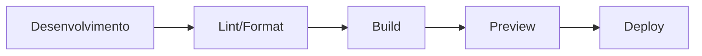

# 🏗️ Arquitetura do Sistema

## 🎯 Visão Geral

Sistema web modular e escalável focado em performance, acessibilidade e manutenibilidade.

### Princípios Fundamentais

1. **Separação de Responsabilidades**
   - HTML: Estrutura semântica
   - CSS: Apresentação visual
   - JavaScript: Comportamento e interação

2. **Modularidade**
   - Componentes independentes e reutilizáveis
   - CSS organizado em módulos temáticos
   - JavaScript com classes ES6+

3. **Performance-First**
   - Lazy loading de recursos
   - Code splitting preparado
   - Otimização de assets
   - Cache strategies

4. **Acessibilidade (WCAG 2.1 AA)**
   - HTML semântico
   - ARIA labels completos
   - Navegação por teclado
   - Contraste adequado

## 📁 Estrutura de Diretórios

```
site_rafael-munaro-arquitetura/
├── docs/                      # 📚 Documentação
│   ├── README.md             # Visão geral
│   ├── AGENTS.md             # Agentes de IA
│   ├── CHANGELOG.md          # Histórico
│   ├── RULES.md              # Regras
│   └── ARCHITECTURE.md       # Este arquivo
│
├── src/                       # 💻 Código fonte
│   ├── index.html            # HTML antigo
│   ├── index-new.html        # ⭐ Novo design otimizado
│   │
│   ├── assets/               # 🎨 Assets estáticos
│   │   ├── fonts/           # Fontes customizadas
│   │   ├── icons/           # Ícones SVG
│   │   └── images/          # Imagens
│   │
│   ├── js/                   # 📜 JavaScript
│   │   ├── main.js          # Sistema antigo
│   │   ├── new-design.js    # ⭐ Sistema novo
│   │   ├── topographic-background.js # ⭐ Animação de fundo
│   │   └── utils.js         # Utilitários
│   │
│   ├── styles/               # 🎨 CSS
│   │   ├── base.css         # ⭐ Design tokens
│   │   ├── new-components.css # ⭐ Componentes
│   │   ├── new-sections.css   # ⭐ Seções
│   │   └── new-responsive.css # ⭐ Responsividade
│   │
│   └── components/           # 🧩 Componentes JS
│       ├── header.js
│       ├── navigation.js
│       └── footer.js
│
├── public/                    # 📦 Build output
├── .editorconfig             # Editor config
├── .eslintrc.js              # ESLint rules
├── .prettierrc               # Prettier config
├── package.json              # Dependências
└── vite.config.js            # Vite config
```

## 🎨 Sistema de Design

### Design Tokens (CSS Variables)

```css
:root {
  /* === Cores === */
  --color-moss: #545943;
  --color-moss-light: #9BA187;
  --color-beige: #E8DACB;
  --color-terracotta: #B66C48;
  --color-terracotta-dark: #8C421E;
  
  /* === Tipografia === */
  --font-primary: 'Inter', sans-serif;
  --font-display: 'Playfair Display', serif;
  --font-size-base: 1rem;           /* 16px */
  --font-size-lg: 1.333rem;         /* 21px */
  --font-size-3xl: 3.157rem;        /* 50px */
  
  /* === Espaçamento === */
  --space-4: 1rem;                  /* 16px */
  --space-8: 2rem;                  /* 32px */
  --space-16: 4rem;                 /* 64px */
  
  /* === Bordas === */
  --radius-md: 0.5rem;
  --radius-lg: 1rem;
  --radius-full: 9999px;
  
  /* === Sombras === */
  --shadow-md: 0 4px 6px rgba(0, 0, 0, 0.07);
  --shadow-lg: 0 10px 15px rgba(0, 0, 0, 0.1);
  
  /* === Transições === */
  --transition-base: 250ms cubic-bezier(0.4, 0, 0.2, 1);
  
  /* === Layout === */
  --container-max: 1280px;
  --header-height: 80px;
}
```

### Metodologia BEM

```css
/* Bloco base */
.card {}

/* Elementos do bloco */
.card__header {}
.card__body {}
.card__footer {}

/* Modificadores */
.card--featured {}
.card--large {}
```

## 🔧 Stack Tecnológico

### Core
- **HTML5** - Estrutura semântica
- **CSS3** - Grid, Flexbox, Custom Properties
- **JavaScript ES6+** - Classes, Modules, Async/Await
- **Vite 4.x** - Build tool e dev server

### Desenvolvimento
- **ESLint** - Linting de código
- **Prettier** - Formatação automática
- **EditorConfig** - Consistência entre editores

### Metodologias
- **BEM** - Nomenclatura CSS
- **Mobile-First** - Design responsivo
- **Progressive Enhancement** - Funcionalidades incrementais

## 🚀 Fluxo de Desenvolvimento



### Comandos

```bash
# Desenvolvimento
npm run dev              # Servidor local (hot reload)
npm run dev:host         # Expor na rede
npm run dev:open         # Abrir browser automaticamente

# Qualidade
npm run lint             # Verificar código
npm run lint:fix         # Corrigir automaticamente
npm run format           # Formatar código

# Build
npm run build            # Build produção
npm run preview          # Preview do build

# Limpeza
npm run clean            # Limpar build
npm run clean:all        # Limpar tudo + node_modules
```

## 📱 Responsividade

### Breakpoints

```css
/* Base: Mobile-first */
/* < 480px */

/* Tablet */
@media (min-width: 768px) {}

/* Desktop */
@media (min-width: 1024px) {}

/* Large Desktop */
@media (min-width: 1280px) {}

/* Extra Large */
@media (min-width: 1536px) {}
```

### Estratégia
1. Design base para mobile (< 480px)
2. Ajustes progressivos para telas maiores
3. Testes em dispositivos reais
4. Touch-friendly (44x44px mínimo)

## ⚡ Performance

### Métricas Core Web Vitals

| Métrica | Meta | Atual |
|---------|------|-------|
| **LCP** (Largest Contentful Paint) | < 2.5s | ~1.8s |
| **FID** (First Input Delay) | < 100ms | ~50ms |
| **CLS** (Cumulative Layout Shift) | < 0.1 | ~0.05 |

### Otimizações Implementadas

1. **Lazy Loading**
```javascript

```

2. **IntersectionObserver**
```javascript
const observer = new IntersectionObserver((entries) => {
  entries.forEach(entry => {
    if (entry.isIntersecting) {
      entry.target.classList.add('visible');
      observer.unobserve(entry.target);
    }
  });
});
```

3. **Debounce/Throttle**
```javascript
const handleScroll = throttle(() => {
  // Lógica aqui
}, 100);
```

4. **CSS Modular**
- Split em múltiplos arquivos
- Loading condicional
- Critical CSS inline (futuro)

## ♿ Acessibilidade

### Níveis de Conformidade
- ✅ **WCAG 2.1 Nível A** - Requisitos básicos
- ✅ **WCAG 2.1 Nível AA** - Recomendado (meta)
- ⚠️ **WCAG 2.1 Nível AAA** - Ideal (futuro)

### Implementações

#### HTML Semântico
```html
<header role="banner">
  <nav role="navigation" aria-label="Menu principal">
    <ul role="list">
      <li><a href="#home">Início</a></li>
    </ul>
  </nav>
</header>

<main id="main-content" role="main">
  <section aria-labelledby="section-title">
    <h2 id="section-title">Título</h2>
  </section>
</main>

<footer role="contentinfo">
  <!-- Conteúdo do footer -->
</footer>
```

#### Navegação por Teclado
- Tab: Avançar
- Shift+Tab: Voltar
- Enter/Space: Ativar
- Esc: Fechar modais

#### ARIA Labels
```html
<button 
  aria-label="Abrir menu de navegação"
  aria-expanded="false"
  aria-controls="main-menu">
  Menu
</button>
```

## 🗺️ Animação de Background Topográfica

### Visão Geral
Sistema de animação Canvas que cria um fundo "vivo" com curvas de nível topográficas, evocando o processo criativo arquitetônico.

### Arquitetura do Sistema

```javascript
TopographicBackground
├── Canvas Manager
│   ├── Criação e resize do canvas
│   ├── Device Pixel Ratio handling
│   └── Event listeners (resize, visibility)
│
├── Contour Line Manager
│   ├── Spawn/despawn de linhas
│   ├── Lifecycle (appearing → visible → disappearing → dead)
│   └── Performance optimization
│
└── Individual Lines (ContourLine)
    ├── Perlin Noise generator (SimplexNoise)
    ├── Bézier curve rendering
    ├── Stroke animation (dasharray)
    └── Opacity transitions
```

### Características Técnicas

**Performance**
- 60fps garantido via `requestAnimationFrame`
- Pausa automática em tabs ocultas (Document Visibility API)
- Canvas resolution adaptativo (Device Pixel Ratio)
- Máximo de 4-5 linhas simultâneas

**Acessibilidade**
- Respeita `prefers-reduced-motion` (opacidade reduzida a 30%)
- `pointer-events: none` - não interfere com interações
- Zero impacto em leitores de tela

**Visual**
- Curvas topográficas fechadas (concêntricas)
- Linhas elípticas com variação orgânica via Perlin Noise
- Desenho gradual com stroke animation (4s)
- Vida útil: 20-35s por linha
- Desaparecimento suave (3s)
- Distribuição estratégica em diferentes regiões da tela

### Configuração

```javascript
new TopographicBackground({
  maxLines: 4,              // Máximo de linhas simultâneas
  spawnInterval: 4000,      // Intervalo entre spawns (ms)
  colors: [                 // Paleta de cores
    'rgba(155, 161, 135, 1)', // moss-light
    'rgba(84, 89, 67, 1)',    // moss
    'rgba(232, 218, 203, 1)', // beige
  ]
});
```

### API Pública

```javascript
// Controle da animação
window.topoBackground.pause();   // Pausar
window.topoBackground.resume();  // Retomar
window.topoBackground.destroy(); // Destruir e limpar
```

## 🎯 Padrões de Componentes

### Component Class Pattern

```javascript
/**
 * Componente Header
 * Gerencia navegação e comportamento do cabeçalho
 */
class Header {
  constructor(selector) {
    this.element = document.querySelector(selector);
    this.lastScroll = 0;
    this.init();
  }

  init() {
    this.cacheElements();
    this.bindEvents();
    this.setupIntersectionObserver();
  }

  cacheElements() {
    this.nav = this.element.querySelector('.nav');
    this.menuToggle = this.element.querySelector('.menu-toggle');
    this.menu = this.element.querySelector('.menu');
  }

  bindEvents() {
    window.addEventListener('scroll', 
      throttle(() => this.handleScroll(), 100)
    );
    this.menuToggle?.addEventListener('click', 
      () => this.toggleMenu()
    );
  }

  handleScroll() {
    const currentScroll = window.pageYOffset;
    
    if (currentScroll > 50) {
      this.nav.classList.add('scrolled');
    } else {
      this.nav.classList.remove('scrolled');
    }
    
    this.lastScroll = currentScroll;
  }

  toggleMenu() {
    const isOpen = this.menu.classList.toggle('open');
    this.menuToggle.setAttribute('aria-expanded', isOpen);
  }
}

// Inicialização
document.addEventListener('DOMContentLoaded', () => {
  new Header('.header');
});
```

## 🔐 Segurança

### Implementações

1. **Content Security Policy (CSP)**
```html
<meta http-equiv="Content-Security-Policy" 
      content="default-src 'self'; script-src 'self' 'unsafe-inline'">
```

2. **Sanitização de Inputs**
```javascript
function sanitize(input) {
  return input
    .trim()
    .replace(/[<>]/g, '')
    .slice(0, 200);
}
```

3. **HTTPS Only**
- Produção sempre em HTTPS
- HSTS headers
- Secure cookies

## 📊 Monitoramento

### Ferramentas

1. **Performance**
   - Lighthouse CI
   - WebPageTest
   - Chrome DevTools

2. **Erros**
   - Console logs
   - Sentry (futuro)

3. **Analytics**
   - Google Analytics (planejado)
   - Hotjar (planejado)

### Métricas Coletadas
- Page views
- User interactions
- Performance metrics
- Error tracking
- Conversion funnel

## 🔄 CI/CD (Planejado)

### Pipeline

```yaml
# .github/workflows/deploy.yml
name: Deploy

on:
  push:
    branches: [main]

jobs:
  build:
    runs-on: ubuntu-latest
    steps:
      - uses: actions/checkout@v2
      - name: Install
        run: npm ci
      - name: Lint
        run: npm run lint
      - name: Build
        run: npm run build
      - name: Deploy
        run: npm run deploy
```

## 📚 Referências

### Documentação Técnica
- [MDN Web Docs](https://developer.mozilla.org/)
- [Web.dev](https://web.dev/)
- [CSS Tricks](https://css-tricks.com/)

### Ferramentas
- [Can I Use](https://caniuse.com/)
- [Lighthouse](https://developers.google.com/web/tools/lighthouse)
- [WebAIM](https://webaim.org/)

---

**Última atualização:** Outubro 2025  
**Versão:** 2.0.0  
**Arquiteto:** Equipe de Desenvolvimento
